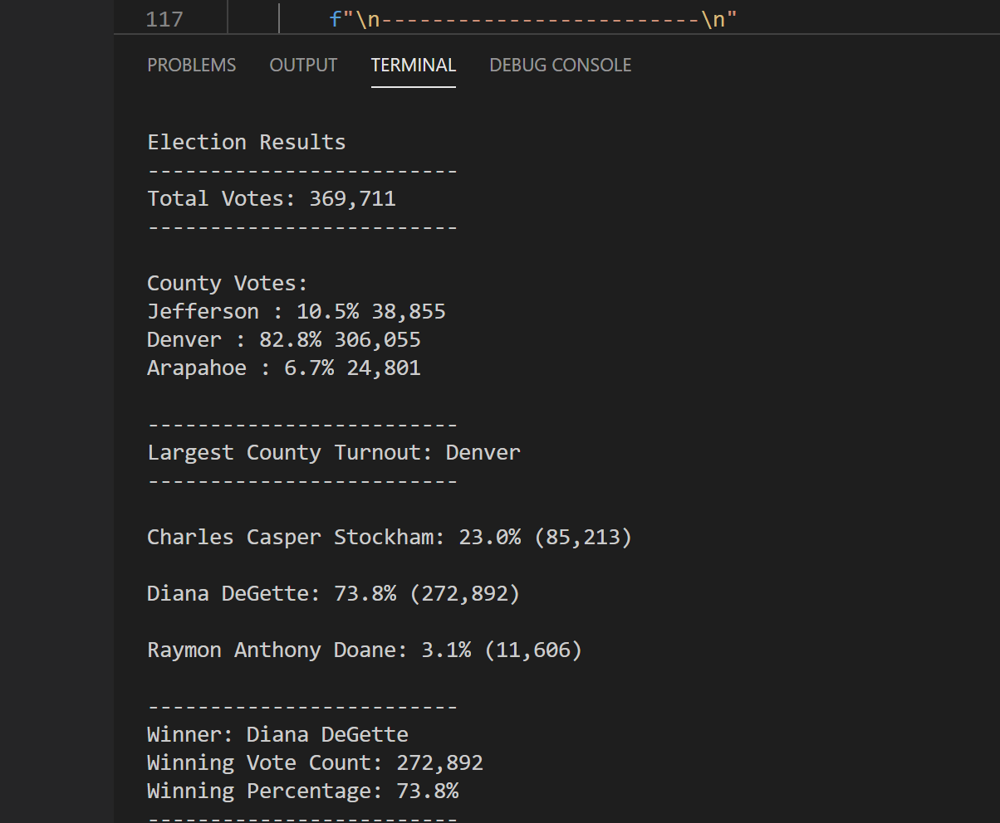
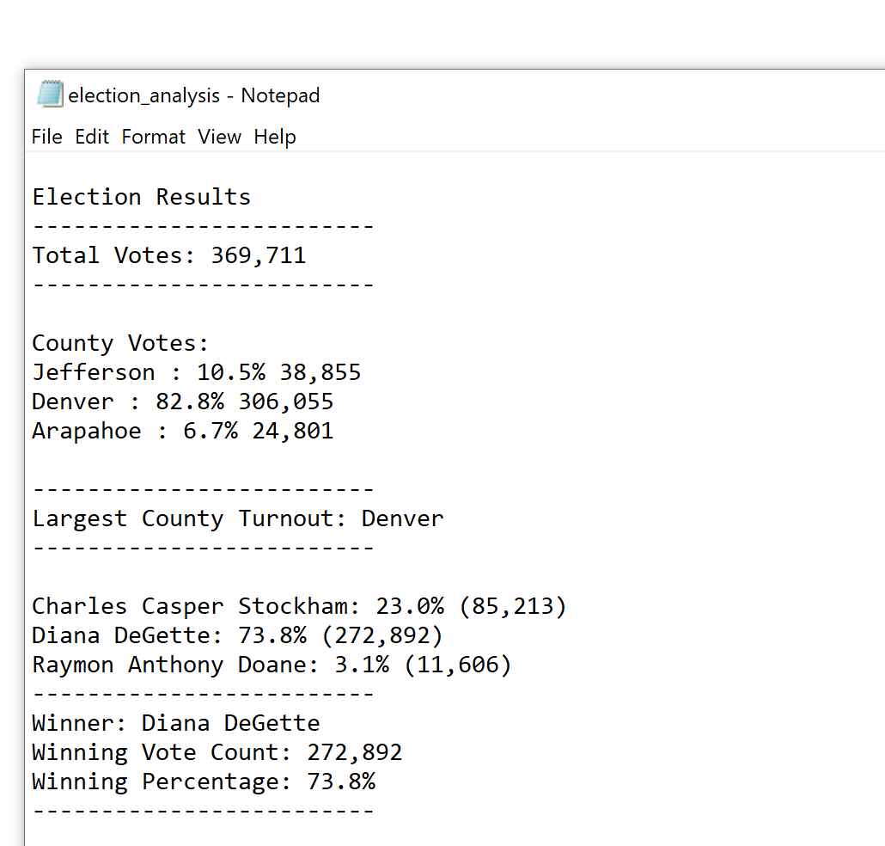

# Election_Analysis

## Project Overview
Seth and Tom are both Colorado Board of Elections and they have given me the task to complete the election audit of a recently completed local congressional election
They want to get the following information:

  - Total number of votes cast
  - A complete list of candidates who received votes
  - Total number of votes each candidate received
  - Percentage of votes each candidate won
  - The winner of the election based on popular vote

## Resources

-Data source: election_result.csv

-Software: Python 3.6.1, Visual Studio Code, 1. 38.1

## Election Audit Results

The audit result was explained using the lines of code below, attached a text file to explain the analysis

## Election Audit Summary

The audit analysis script can be used for other elections, like other congressional district or localelection. This can be achieved by changing the county vote to senatorial 
The election analysis shows that :

  - The ***total number of votes*** cast in the election is ***369,711***
  
  - The ***candidates*** that contested in the election were:
  
        - Charles Casper Stockham
        - Diana DeGette
        - Raymon Anthony Doane
        
- The canditate ***results*** were

        - Charles Casper Stockham got  23.0%  of  the vote and 85,213 number of votes
        - Diana DeGette got 73.8% of  the vote and 272,892 number of votes
        - Raymon Anthony Doane got 3.1% of the vote and 11,606 number of votes

- The ***winner*** of the election was 

        -  Diana DeGette, who received 73.8% of  the vote and 272,892 number of votes

## Challenge Overview

I started the analysis by writing a pseudocode to highlight the necessary steps involved to complete the task. 
After every line of code, I comment out the pseudocode by adding hashtag, so that python will not run it as part of the command
I imported "os" and "csv" to allow me to read and open the source file
I created a text file, by changing "r" to "w" on the folder path (where I created an output folder) to allow me write the output of the analysis
I completed the first task by checking the number of votes

        # Add our dependencies.
import csv
import os
##### Assign a variable to load a file from a path.
file_to_load = os.path.join("Resources", "election_results.csv")
##### Assign a variable to save the file to a path.
file_to_save = os.path.join("analysis", "election_analysis.txt")

##### 1. Initialize a total vote counter.
total_votes = 0

##### Open the election results and read the file
with open(file_to_load) as election_data:
    file_reader = csv.reader(election_data)

    # Read the header row.
    headers = next(file_reader)

    # Print each row in the CSV file.
    for row in file_reader:
        # 2. Add to the total vote count.
        total_votes += 1

##### 3. Print the total votes.
print(total_votes)

The second task to know the list of candidates

        # Candidate Options
candidate_options = []

##### Open the election results and read the file.
with open(file_to_load) as election_data:
    file_reader = csv.reader(election_data)

    # Read the header row.
    headers = next(file_reader)

    # Print each row in the CSV file.
    for row in file_reader:
        # Add to the total vote count.
        total_votes += 1

        # Print the candidate name from each row.
        candidate_name = row[2]

        # If the candidate does not match any existing candidate...
        if candidate_name not in candidate_options:
            # Add it to the list of candidates.
            candidate_options.append(candidate_name)

##### Print the candidate list.
print(candidate_options)

The third task, to get total vote fpor each candidate

        # Candidate options and candidate votes
candidate_options = []
##### 1. Declare the empty dictionary.
candidate_votes = {}

if candidate_name not in candidate_options:

            # Add the candidate name to the candidate list.
            candidate_options.append(candidate_name)

           # Begin tracking that candidate's vote count.
            candidate_votes[candidate_name] = 0

        # Add a vote to that candidate's count
        candidate_votes[candidate_name] += 1

##### Print the candidate vote dictionary.
print(candidate_votes)

The fourth task, to determine the percentage vote for each candidate
        # Determine the percentage of votes for each candidate by looping through the counts.
##### Iterate through the candidate list.
for candidate_name in candidate_votes:
   ##### Retrieve vote count of a candidate.
    votes = candidate_votes[candidate_name]
    # Calculate the percentage of votes.
    vote_percentage = float(votes) / float(total_votes) * 100

    #  To do: print out each candidate's name, vote count, and percentage of
    # votes to the terminal.

    # Determine winning vote count and candidate
    # Determine if the votes is greater than the winning count.
    if (votes > winning_count) and (vote_percentage > winning_percentage):
         # If true then set winning_count = votes and winning_percent =
         # vote_percentage.
         winning_count = votes
         winning_percentage = vote_percentage
         # And, set the winning_candidate equal to the candidate's name.
         winning_candidate = candidate_name

##### To do: print out the winning candidate, vote count and percentage to
##### terminal.

And finally, to confirm the winner in teh election,

        print(f"{candidate_name}: {vote_percentage:.1f}% ({votes:,})\n")
        winning_candidate_summary = (
    f"-------------------------\n"
    f"Winner: {winning_candidate}\n"
    f"Winning Vote Count: {winning_count:,}\n"
    f"Winning Percentage: {winning_percentage:.1f}%\n"
    f"-------------------------\n")
print(winning_candidate_summary)

After completing the analysis, I wrote the result in the analysis folder created earlier

        # Save the results to our text file.
with open(file_to_save, "w") as txt_file:
##### Print the final vote count to the terminal.
    election_results = (
        f"\nElection Results\n"
        f"-------------------------\n"
        f"Total Votes: {total_votes:,}\n"
        f"-------------------------\n")
    print(election_results, end="")
    # Save the final vote count to the text file.
    txt_file.write(election_results)

## Challenge Summary

I used programming to analyze and finalize an election to compare the votes and declear the winner

